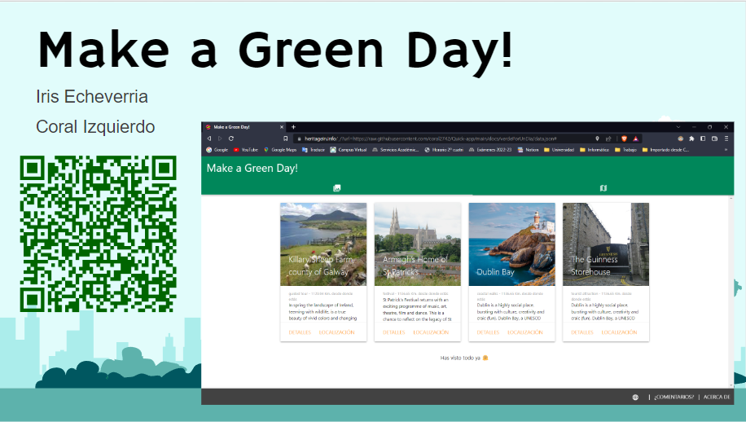
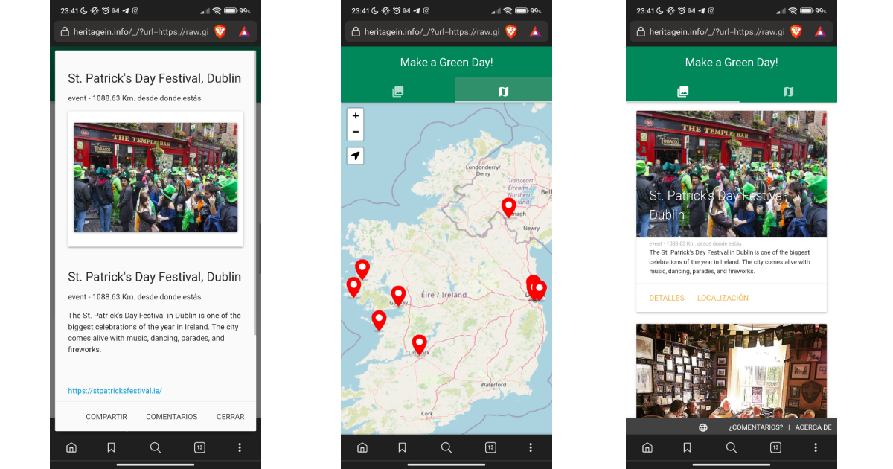
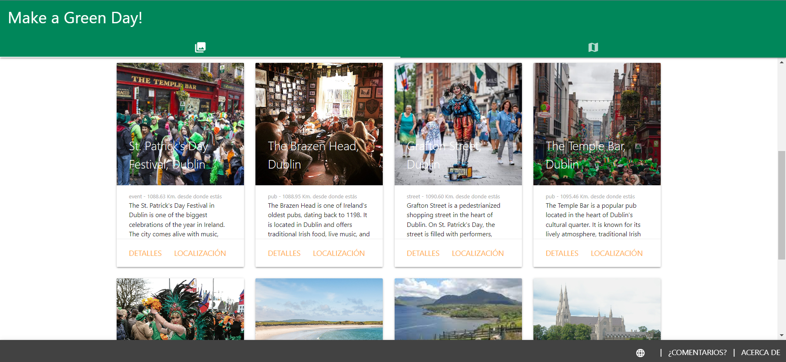
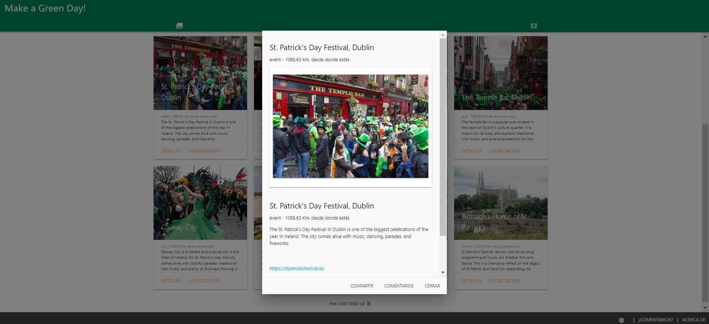

# _Heritage in…_ Ireland (St. Patrick’s Day)🍀

The _Heritage in…_ Ireland Quick app project by [Iris](https://github.com/Jeann11) and [Coral](https://github.com/coral2742) promotes cultural heritage collections in small and medium cities  through open data and crowdsourcing, highlighting relevant sites to celebrate St. Patrick's Day.

> It's free, open-source, and collaborative 

Any city can implement its own application in a few hours. They only need one or more experts to feed the first version of the database. 

## Some screenshots:

## License

This project's documentation, content, and data folders are licensed under a [CC-BY license](https://github.com/ow2-quick-app-initiative/poi-quick-app-implementations/blob/main/LICENSE).

All other code in this repository is licensed under the [MIT license](https://github.com/ow2-quick-app-initiative/poi-quick-app-implementations/blob/main/LICENSE-CODE).

## Privacy

These apps are based on open data and automatic processing of the data. The community's content is enriched and curated, so it's available to anyone who wants to get involved. Local experts are welcome to refine the definitions, names, and pictures and add new points of interest to the app.

The app doesn't collect any personal data, so relax. We won't sell anything.

The app may perform a call to a [Matomo](https://en.wikipedia.org/wiki/Matomo_(software)) instance to measure its performance, but no personal data is shared. You can just [check the code](https://github.com/ow2-quick-app-initiative/poi-quick-app-implementations/blob/eb7cd317eced2fe6ebe51e5210589aff7ac2675e/quick-app/leuven/src/app.ux#L222) that generates a random identifier.  

## Developers

> Do you want to contribute to the code?

Just fork the repository and start sending your contributions. The code of the quick app is in the [`/quick-app`](https://github.com/ow2-quick-app-initiative/poi-quick-app/tree/main/quick-app) folder of the repository. 

Feel free to [raise issues](https://github.com/ow2-quick-app-initiative/poi-quick-app-implementations/issues/new) on the code.

Quick links: 
- [Repository with the methodology and docs (poi-quick-app)](https://github.com/ow2-quick-app-initiative/poi-quick-app)
- [Repository of implementations and templates (poi-quick-app-implementations)](https://github.com/ow2-quick-app-initiative/poi-quick-app-implementations)
- [Repository with the Web app code (poi-quick-app-web)](https://github.com/ow2-quick-app-initiative/poi-quick-app-web)

## Acknowledgments

- Banner picture by [Kasturi Roy on Unsplash](https://unsplash.com/photos/WLlupsRhjyw).
- Information and images by https://stpatricksfestival.ie/ https://es.m.wikipedia.org, https://www.galwaytourism.ie/ and https://www.discoverireland.ie